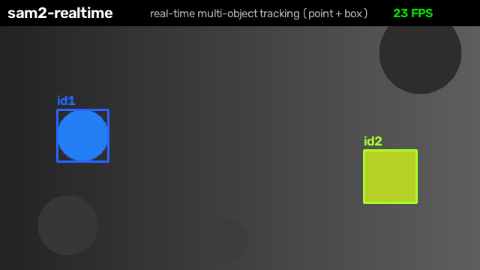

# sam2-realtime

Real-time object tracking with [SAM 2](https://github.com/facebookresearch/sam2) on a **live camera**
or a **long / high-resolution video** — with memory that stays flat no matter how long you run.



SAM 2's own video predictor loads the entire video into memory before it can track. That is fine for
short clips, but it breaks for two common cases:

- a **webcam / RTSP stream**, which never ends, and
- a **long or 4K video**, which can be tens of gigabytes once decoded (enough to OOM the GPU or the
  machine).

`sam2-realtime` feeds frames through SAM 2 **one at a time** and keeps only a small rolling window in
memory, so GPU and RAM usage are constant whether you track for ten seconds or ten hours.

## Features

- **Live camera tracking** at real-time frame rates (tiny model ≈ 20–40 FPS on a modern GPU).
- **Bounded memory** for arbitrarily long / high-res video — a few hundred MB of GPU, ~2 GB RAM, flat.
- **Multiple objects** at once, each with its own id and mask.
- **Point and box prompts** (click a point, or draw a box).
- Thin wrapper — you keep using SAM 2's own model builder and checkpoints.

## How it works (short version)

Two things normally grow without limit; we bound both:

1. **Frames.** SAM 2 only ever reads the *current* frame, so we keep a fixed-size **ring buffer** of
   the last few frames and overwrite the oldest as new ones arrive. The frame index keeps counting up
   (SAM 2's temporal memory needs the true gap), only the storage slot wraps (`index % width`).
2. **Tracker memory.** SAM 2 attends to roughly the last ~7 frames of its own memory, so we drop
   anything older each step instead of letting it pile up.

The result is a small, constant memory footprint. See [`docs/how-it-works.md`](docs/how-it-works.md)
for the longer explanation with a worked example.

## Requirements

- Python ≥ 3.10, a CUDA GPU, and PyTorch matching your CUDA version.
- SAM 2 installed from source, plus a checkpoint (both from the official repo).

## Install

```bash
# 1. PyTorch for your CUDA version — see https://pytorch.org
pip install torch torchvision

# 2. SAM 2 (the model) + a checkpoint
git clone https://github.com/facebookresearch/sam2.git
pip install -e "./sam2[notebooks]"          # add SAM2_BUILD_CUDA=0 if you have no nvcc
bash ./sam2/checkpoints/download_ckpts.sh    # downloads the sam2.1 checkpoints

# 3. sam2-realtime
git clone https://github.com/mohammadakbar2603/sam2-realtime.git
pip install -e ./sam2-realtime
```

## Quickstart

```python
import cv2
from sam2.build_sam import build_sam2_video_predictor
from sam2_realtime import LiveSAM2, overlay_masks

predictor = build_sam2_video_predictor(
    "configs/sam2.1/sam2.1_hiera_t.yaml", "checkpoints/sam2.1_hiera_tiny.pt", device="cuda")
live = LiveSAM2(predictor)                    # ring buffer + memory eviction handled for you

cap = cv2.VideoCapture(0)
first = cv2.cvtColor(cap.read()[1], cv2.COLOR_BGR2RGB)

# describe the objects on the first frame: a point and/or a box, each with an id
prompts = [
    {"obj_id": 1, "kind": "point", "xy": (640, 360)},
    {"obj_id": 2, "kind": "box",   "box": (300, 100, 500, 400)},
]

def next_frame():
    ok, bgr = cap.read()
    return cv2.cvtColor(bgr, cv2.COLOR_BGR2RGB) if ok else None

for frame_idx, frame_rgb, masks in live.track(first, prompts, next_frame):
    # masks: {obj_id: HxW bool array}
    cv2.imshow("sam2-realtime", overlay_masks(frame_rgb, masks))
    if cv2.waitKey(1) == 27:                  # Esc to quit
        break
cap.release()
```

`live.track(...)` is a generator: it yields one `(frame_idx, frame_rgb, masks)` per frame and pulls
the next frame from the callable you pass. It works the same for a file — just make `next_frame`
read from a video or a folder of frames.

## Command-line examples

```bash
# Live webcam: click the object in the window, then it tracks (Esc to quit)
python examples/track_camera.py --cfg configs/sam2.1/sam2.1_hiera_t.yaml \
    --ckpt checkpoints/sam2.1_hiera_tiny.pt --cam 0

# Long / high-res video: seed a box on frame 0, write an annotated mp4, flat memory
python examples/track_video.py --cfg configs/sam2.1/sam2.1_hiera_t.yaml \
    --ckpt checkpoints/sam2.1_hiera_tiny.pt \
    --video input.mp4 --box 300 100 500 400 --out tracked.mp4
```

## Model sizes

Swap the config and checkpoint together. `tiny` is the fastest; `large` gives the sharpest masks.

| size | config | checkpoint |
|------|--------|------------|
| tiny  | `sam2.1_hiera_t.yaml`  | `sam2.1_hiera_tiny.pt` |
| small | `sam2.1_hiera_s.yaml`  | `sam2.1_hiera_small.pt` |
| base+ | `sam2.1_hiera_b+.yaml` | `sam2.1_hiera_base_plus.pt` |
| large | `sam2.1_hiera_l.yaml`  | `sam2.1_hiera_large.pt` |

## Limitations

- **Point/box/mask prompts only** — no text prompts. You track what you mark.
- **Short memory.** SAM 2 bridges brief occlusions (a handful of frames) but is a continuous tracker,
  not a re-identification model: an object gone for a long time usually needs to be re-seeded. Feeding
  fewer frames per second stretches how much real time that window covers.
- FPS scales down with the number of tracked objects.

## Acknowledgements

Built on Meta's [Segment Anything Model 2](https://github.com/facebookresearch/sam2). This project is
a thin streaming wrapper and does not include or modify the SAM 2 model code.

## License

Apache-2.0. See [LICENSE](LICENSE).
